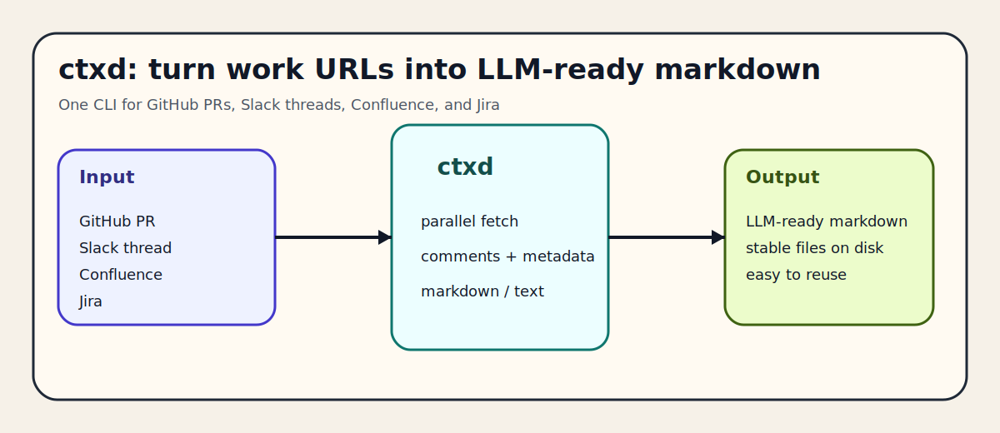

# ctxd

Turn work URLs into LLM-ready Markdown.

**📖 [中文文档](README_CN.md)**



GitHub PRs, Slack threads, Confluence pages, and Jira issues — one command, one Markdown file you can save, diff, or feed to a model.

## Agent skill (recommended)

ctxd ships a companion skill at [skills/ctxd/SKILL.md](skills/ctxd/SKILL.md) that works with both **Claude Code** and **Codex CLI**. It teaches the agent to reach for `ctxd` whenever a supported URL appears in the conversation, instead of falling back to chat-style fetching or in-model connectors.

```bash
# Claude Code
mkdir -p ~/.claude/skills && ln -s "$(realpath skills/ctxd)" ~/.claude/skills/ctxd

# Codex CLI
mkdir -p ~/.codex/skills && ln -s "$(realpath skills/ctxd)" ~/.codex/skills/ctxd
```

The skill assumes [Required config](#required-config) is already set up — if credentials are missing, the agent will tell you which key it needs before attempting a fetch.

## Why ctxd

- **CLI-first, not chat-first** — one command produces a stable Markdown artifact you can inspect, diff, archive, or feed into any model. No drip-feeding through many tool calls.
- **Comments and metadata stay attached** — PR reviews and inline threads, Slack threading, Confluence attachments and page metadata, Jira custom fields all preserved.
- **Bulk export is the default** — page trees, long threads, heavy PRs come out as one file. Parallel fetch across all sources (see [Performance](#performance) for numbers).

## When CLI beats connectors

| Situation | `ctxd` CLI | In-model connector |
|--------|--------|--------|
| Export a whole Confluence page tree | Best fit | Usually many tool calls |
| Dump a long Slack thread for later summarization | Best fit | Usually repeated fetch + resolution |
| Save a PR review artifact to disk | Best fit | Usually no persistent artifact |

## Quick examples

```bash
# GitHub PR -> markdown file
ctxd -O https://github.com/owner/repo/pull/123

# Slack thread -> stdout
ctxd https://app.slack.com/client/T.../C.../thread/C...-1234567890.123456

# Confluence page tree with images -> local directory
ctxd https://your-site.atlassian.net/wiki/spaces/SPACE/pages/123456 -r -i -O

# Jira issue -> Obsidian-ready note
ctxd https://your-site.atlassian.net/browse/PROJECT-123 --obsidian -O
```

## Supported Sources

| Source | URL Pattern |
|--------|-------------|
| GitHub PR | `https://github.com/<owner>/<repo>/pull/<number>` |
| Slack Thread | `https://*.slack.com/archives/...` or `.../client/.../thread/...` |
| Confluence | `https://*.atlassian.net/wiki/...` |
| Jira | `https://*.atlassian.net/browse/<KEY>` |

## Installation

### Homebrew (recommended)

```bash
brew tap cheerchen/tap
brew install ctxd
```

### From source

```bash
cd ctxd
uv sync --group dev
```

## Required config

Before an agent can actually fetch anything, the relevant auth must already exist.

Config file:

```bash
~/.config/ctxd/config
```

Typical keys:

```bash
SLACK_TOKEN=xoxp-...
CONFLUENCE_BASE_URL=https://your-site.atlassian.net
CONFLUENCE_EMAIL=you@example.com
CONFLUENCE_API_TOKEN=your-token
```

GitHub PR export uses `gh`, so make sure this is valid too:

```bash
gh auth status
```

## Global Options

| Option | Description |
|--------|-------------|
| `-o, --output <path>` | Write to file/directory (default: stdout) |
| `-O, --auto-output` | Auto-generate output path by source (mutually exclusive with `-o`) |
| `-f, --format text\|md` | Output format (default: `md`) |
| `-q, --quiet` | Suppress progress logs (auto-enabled when stderr is not a TTY) |
| `-v, --verbose` | Verbose logging |
| `--profile` | Print stage / HTTP / subprocess timing summary |
| `--max-concurrency <N>` | Cap parallel work across fetchers (default: `5`) |
| `--recurse-depth <N>` | Cross-source recursion: expand supported URLs found in output (default: `0`=off, max `2`; opt-in with `1`/`2`) |
| `--no-recurse` | Disable cross-source recursion (equivalent to `--recurse-depth 0`; kept for explicitness) |

Options can be placed before or after the URL (e.g. both `ctxd -q <url>` and `ctxd <url> -q`).

---

## GitHub PR

Export PR metadata, reviews, inline comments, timeline comments, and code changes.

### Prerequisites

Install and authenticate [GitHub CLI](https://cli.github.com/):

```bash
brew install gh
gh auth login
```

### Usage

```bash
ctxd https://github.com/owner/repo/pull/123
ctxd https://github.com/owner/repo/pull/123 -o pr-123.md
ctxd -O https://github.com/owner/repo/pull/123
```

### Options

| Option | Description |
|--------|-------------|
| `-d, --diff-mode full\|compact\|stat` | Diff output mode (default: `compact`) |
| `--clean-body / --no-clean-body` | Strip bot-injected HTML noise from PR body (default: on) |
| `--no-bots` | Drop bot-authored reviews and comments (default: keep all bots) |

---

## Slack Thread

Export a full Slack thread with username resolution and attachments.

### Prerequisites

Requires a Slack User Token (`xoxp-...`) with the following scopes:
- `channels:history`, `groups:history`, `im:history`, `mpim:history`
- `users:read`
- `files:read` (if downloading attachments)

Obtain at: [api.slack.com/apps](https://api.slack.com/apps) → Your App → OAuth & Permissions → User Token.

Configure the token (pick one):

```bash
# Option 1: Environment variable
export SLACK_TOKEN="xoxp-..."

# Option 2: Config file
mkdir -p ~/.config/ctxd
echo 'SLACK_TOKEN=xoxp-...' >> ~/.config/ctxd/config
```

### Usage

```bash
# New URL format
ctxd https://app.slack.com/client/T.../C.../thread/C...-1234567890.123456

# Archive URL format
ctxd https://your-workspace.slack.com/archives/C.../p...?thread_ts=...
```

When you copy a link to a specific reply (archive URL with `?thread_ts=` where the path ts differs from the thread root), `ctxd` fetches the entire thread but highlights the focused message — a `**Focused Message:**` line in the header and a `▶` marker on the corresponding message in the conversation flow.

### Options

| Option | Description |
|--------|-------------|
| `--download-files` | Download attachments to `./attachments` as `IMG_{file_id}.{ext}` (e.g. `IMG_F0AAAAAAA1.png`); requires `files:read` scope on the Slack token |
| `--raw` | Keep original Slack mrkdwn markup |

---

## Confluence

Export Confluence pages to Markdown. By default prints a single page to stdout; pass `-r` / `-i` with `-o <dir>` (or `-O`) to opt into recursive export with images.

### Prerequisites

Requires an Atlassian API Token. Obtain at: [id.atlassian.com/manage-profile/security/api-tokens](https://id.atlassian.com/manage-profile/security/api-tokens).

Configure (all three values are required). Pick one:

```bash
# Option 1: Environment variables
export CONFLUENCE_BASE_URL="https://your-site.atlassian.net"
export CONFLUENCE_EMAIL="you@example.com"
export CONFLUENCE_API_TOKEN="your-token"

# Option 2: Config file (recommended for persistent use)
mkdir -p ~/.config/ctxd
cat >> ~/.config/ctxd/config <<'EOF'
CONFLUENCE_BASE_URL=https://your-site.atlassian.net
CONFLUENCE_EMAIL=you@example.com
CONFLUENCE_API_TOKEN=your-token
EOF
chmod 600 ~/.config/ctxd/config
```

Environment variables take precedence over the config file, so CI and one-off overrides work unchanged. If the file is readable by group/others, ctxd prints a one-shot stderr warning with the exact `chmod 600` command to fix it.

### Usage

```bash
# Default: single page to stdout
ctxd https://your-site.atlassian.net/wiki/spaces/SPACE/pages/123456

# Tiny link (short URL) — resolved via authenticated redirect
ctxd https://your-site.atlassian.net/wiki/x/ABC123

# Recursive export with images, to an explicit directory
ctxd https://your-site.atlassian.net/wiki/spaces/SPACE/pages/123456 -r -i -o ./output

# Or let ctxd pick the output directory name
ctxd https://your-site.atlassian.net/wiki/spaces/SPACE/pages/123456 -r -i -O
```

> **Note**: `-r` / `-i` / `--all-attachments` require `-o <dir>` or `-O` (Confluence writes a directory tree / images to disk).
> **Tiny links**: `/wiki/x/<token>` URLs are followed once (after auth) and rewritten to the canonical long URL before any page fetch; `-O` auto-output names them `confluence-<token>` since the real page id isn't known at filename time.

### Options

| Option | Description |
|--------|-------------|
| `-r, --recursive / --no-recursive` | Include child pages (default: off) |
| `-i, --include-images / --no-include-images` | Download referenced images (default: off) |
| `--all-attachments` | Download all attachments (default: only referenced images) |
| `--debug` | Save raw HTML for debugging |

---

## Jira

Export full Jira issue content (description, comments, custom fields).

### Prerequisites

Shares authentication with Confluence (see above), so the same config applies. Jira also supports `--debug` for raw HTML saving.

### Usage

```bash
ctxd https://your-site.atlassian.net/browse/PROJECT-123
ctxd https://your-site.atlassian.net/browse/PROJECT-123 -o issue.md
```

---

## Cross-source recursion

By default, cross-source recursion is **off** (`--recurse-depth 0`). Opt in with `--recurse-depth 1` or `2` to have `ctxd` scan the rendered output for supported URLs (Slack, GitHub PR, Confluence, Jira) and fetch them too, appending the results as a labelled appendix. This means a Slack thread that links a Jira issue and a GitHub PR pulls all three in one command — no follow-up fetches needed.

```bash
# Recursion off (default) — primary URL only
ctxd https://app.slack.com/client/.../thread/...

# Enable recursion (depth=1, auto-expands linked supported URLs)
ctxd <url> --recurse-depth 1

# Deeper recursion (max 2)
ctxd <url> --recurse-depth 2
```

Key behaviours:
- **Deduplication**: the same URL is never fetched twice within one run.
- **Cap**: at most 5 child URLs are expanded per level (prevents Jira issue-link explosions).
- **Graceful skip**: if a child URL lacks credentials (e.g. a Slack thread links a Confluence page but no Confluence token is configured), the appendix notes the skip instead of failing.
- **Confluence directory export**: recursion is disabled when using `-o`/`-O` with Confluence (which writes a page tree to disk); use stdout for recursion.

---

## Performance

| Scenario | Baseline | Post-opt | Improvement |
|--------|--------:|--------:|--------:|
| Slack thread | 9.09s | 1.61s | 82.3% |
| Confluence single page + image | 1.88s | 1.74s | 7.4% |
| Confluence recursive + images | 27.13s | 4.04s | 85.1% |
| GitHub PR | 6.75s | 4.15s | 38.5% |

## License

[MIT](LICENSE)
